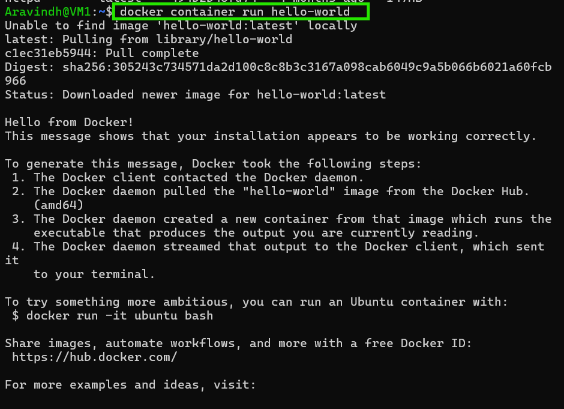

### Docker Commands

**Commands to install docker :**

*   fist command : curl -fsSL https://get.docker.com -o get-docker.sh
    second commad : sh get-docker.sh

* adding User to docker:(sudo will make run it as admin)
    * sudo usermod -aG docker azureuser
* adding a webserver with name nginx1  
    * docker run -d --name nginx1 -P nginx
    *  docker run -d --name apache1 -P httpd
* list of images:
    *  docker images

* dot cloud became docker after releasing docker as open source.

**24/may :**

**Docker Setup :**

* do ssh and connect to linux server 
* enter this cmd to download docker to your machine
    * ```curl -fsSL https://get.docker.com -o get-docker.sh``` click on enter
    * in next line enter this ```sh get-docker.sh```
*   Now enter below commad to provide the Admin priviliges for the user, this command will add your user to the docker group it will provide full permission for your current user
    * ```sudo usermod -aG docker azureuser```
    * by doing above azureuser will get full previliges to docker
* Now enter this command `exit`to exit from your mchine and reconnect to machine using ssh username@vmname, for effective chnages.
* To check just enter ```docker info``` if it shows both server version and client version then you got full access to it.
```
    exit
    shh azureuser@ip_address
 ```
* go to docker hub web site you will find all the feautures that you can run in container ex: mysql, nginx,httpd ..etc

* nginx is **webserver**, httpd is **apache server** 
* go to vm again and enter below cmds
    * ```docker run -d --name ngnix1 -P nginx```
    * this will download and run the nginx webserver, name of this will be **nginx1**
    * ```docker run -d --name apache1 -P httpd```
    * this will download and run the httpd webserver name of this will be **httpd1**
* if you try to install ngnix and apache in one machine(linux machine) by one shot you will get error as "80 port is already in use"
* now enter below command to list out the containers
```
    docker ps
    docker container ls -a
```
* now copy your vm public ip and check the nginx webserver port number, and httpd port number and enter in browser you will get nginx and httpd are running
    * ``` public_ip:32768```
    * you can run as many containers you want do below for awareness
    * 
    ```
    docker run -d --name apache2 -P httpd
    docker run -d --name apache3 -P httpd
         
    ```
* to check status of containers usage 
    * ``` docker stats```
* any os to run on any machine minimun of 4gb+ will be occupied, but in container it is very less
    * ```docker pull alpine```
    * alpine is linux operating system
    *  to see all images we have ```docker images```

**25/may :**

* on any machine when you install docker you will get two components
    * docker engine or docker demon 
    * docker clinet
* to speak with docker engine you would need docker client(cli for docker engine)
* when you open clint and write "docker run nginx" indrectly you are saying i want nginx container, when you did this request will go to the docker demon
* docker demon will have local repository, it will try to ask the repository "do we have nginx image?" if no it will check in online repository
* over the internet we have "Docker hub in technical we call Registry"
* if ngnix image is not present it will pull(download the image from registry) and store to local repository
* now it will create container form nginx image
* ```
    * To create container we need image 
    * using the same image you can create n number of conatiners
    * images are stored and made available using registries and docker is a default registry.
    ```
* container is a runtime in an isolated area which gets 
    * virtual cpu
    * virtual ram
    * v disk(contents will be filled from image)
    * v nic
* **scenario :**
```
when you try to install any OS in your laptop it will take approx 1 hr, where as when you go to any company laptop the repair team will take 10 min to install OS how ??

A . At first time they will also install manually taking 1hr time later, now we know everything wil be stored in disk, these people will take **Ghost image(compressed form of disk) of that disk**. whenever a new person comes they will use this image to install OS becasuse it has all applications pre installed init.

image means - compressed form of disk

```
* **get docker cheetsheet to learn commands**
* **Install Doker :**
* docker can be installed on :
    * windows
    * Mac
    * linux
* we will install in linux most of the time
* Follow above given container creation steps and create a container 
* if you don't know commads
    * just type ```docker run --help``` it will suggest you the all usable commands for run
* else browse for cmd based on your requirement
* create a a vm and elivate the priviliges for your user and create a container
* enter this cmd ``` docker container run hello-world```
 
    * when you hit on enter it will show "unable to find image locally and pulling from registry"
* run the same command again to confirm whether the image is downloaded or not."this time it won't show any not available message as above"
* download ngnix
    ```docker container run -d nginx```
* to list out images use this cmd ``` docker image ls or docker ps -all ```
 ```
how to give a name to container? what happens if you don't give name to a container?
A. if you don't give name to a container docker will provide a random name to it , if you want to provide name ``` --name <name of container>
```

**26/may :**

* every docker image has a tag,if you are not passing tag name it will take latest `<repository>:tag`
```
nginx  => nginx:<tag>
       => ngnix:perl
jenkins => jenkins/jenkins:jdk17

    jenkins => jenins:latest

```

**Container life cycle**
* go to docker play ground create a new vm and connect to it from powershell
* go to vm and do below
    ```
        `docker image ls` check for any images present already
        `docker image pull --help`
    ```
* execute this ```docker pull ngnix```
    * observe the output you will identify that it is stating that it is using latest tag
* now do this ```docker pull nginx:perl```
* now do `docker image ls` to check images, find out `Tags` and if you try to observe the image id
    * if two images are said to be same when their image id's are same
* now we will ceate a container :
    * do this ```docker container create --name nginx1 -P nginx```
    * this will create a container for you check by using cmd ```docker container ls --all```
    * To run container:
        * ```docker container start nginx1```
        * do this to check whether container is runnig `docker container ls --all`
        * obseve the status 
    * To pause container:
        * ```docker container pause nginx1```
        * check `docker container ls --all`
        * check the status
    * To stop the container:
        * ``` docker conatainer stop nginx1```
        * check `docker container ls --all`
        * check the status
    * To start back again:
        * ```docker container start nginx1```
        * check `docker container ls --all`
        * check the status
    * To remove container:
        * first stop the container and remove it
        * ``` docker container stop nginx1```
        * ``` docker container rm nginx1```

* creating container and starting is not recomended we will use below command to create and run the container in one go 
    * ```docker container run -d -P --name nginx2 nginx:perl```
    * stop using ``` docker conatainer stop nginx2```
    * start back ```docker container start nginx2```
    * try removing container when it is runnig ``` docker container rm nginx2```
* Now create a new container 
    * `docker container run --name test1 hello-world`
    * check state `docker container ls -a` check the status `not runnig`
    * we need to understand the thing whenever you try to run the container it doesn't mean it will run container it may or might not be runnig

* create a new vm from azure/aws
    * ssh to vm 
    * do `ifconfig` to know about nic card
    * do `sudo apt update && sudo apt install net-tools -y`
    * do `ifconfig`
    * you will see two network interfaces
        * eth0 - private ip
        * lo(loop back) : "local host" - 127.0.0.1
    * do `htop` for task manager in linux
    * in linux for every process there will be process id , if process id is 1 then that is the process which started at first.
    * check the users list `cat /etc/passwd
    * we will focus on last two users `ubuntu and lxd`
    * check groups `cat /etc/group` take last two groups ` _chrony and ubuntu`
    * check storage `sudo lsblk` find an xvda:8gb disk
* now we will try to install docker
    * use `curl https://............`
    * after installing docker do `if config` and check the network interfaces **`one more wil be added`**
    * check for the users you find no imapct, check for group `you will find a new group` **docker**
* we will run a container now
    * sudo usermod -aG docker <your username>
    * now do this `docker container run -d --name nginx1 nginx`
    * `docker container ls -a` find container is runnig
    * now we go inside of container:
        * `docker container exec -it nginx1 /bin/bash`
        * now your path will change to `root@somenumber:/#`
        * do `apt update && apt install net-tools`
        * do `ifconfig`
        * you will see two network interfaces `lo and eth0`
        * check for runnig process `apt install htop` and do `htop`
        * do `lsblk` you can find same 8gb storage it is usig from root machine
        * do `cat /etc/group` you will find different groups here when compared to root machine
        * check for users `cat /etc/passwd` you will find `nobody`
        * go to root folder `cat /` and do `ls`
        * do `apt install tree -y`
        * execute `tree` you will find many things here, we will navigate to one folder `cd /etc/` and do `ls`
        * do `exit`
        * it will come to root machine execute `tree` you won't find anything because whatever you do inside contair there won't be any impact on container
        * install tree on root machine `sudo apt install tree -y`
        * go to `ls/etc` you will find the same

* now create one more container:
    * `docker container run -d -P --name apache httpd` 
    *  go inside container and create bash `docker container exec -it apache /bin/bash`
    * do `apt update && apt install htop -y (you shouldn't install softwares inside containers for understanding you had to do)
    * do `htop` and observe all the process running about one thing `httpd` unlike root machine

**28/may :**
```
* consider a monolith architechture of any application running in server,it can accept at a limit of 5000 users, if you want to extend you need to run the application in one more server which obiviously called as scaling, now what if users are incresing more and more..
* consider i am runnig an e commerse application on server which do so many things at one runtime like payment, adding products to carts there will so many services running at a time.
* here is our question  who ever the user loged will use all the services? some will just browse and leave some will add products to cart and leave...etc
* no user will use all the services. to solve this we diveded our application into small serivices 
    * catalog service
    * identity sevice
    * cart service
    * payment service
    * notification service .......etc 

* these all component services we will run in each containers when ever the need comes to access any serivce the container will run 

* one more advantage is we can create differnt serives in different languages not by sticking to one language like catalog service in C#,identity sevice in java,cart service in python ..etc
* as definition of microservices, if i found catalog service is written in python is working more efficiently than catalog service in C#, i will be able to remove it and add this to my container without taking more time
* there will be so many sevices like this more than 100, in that case to manage these we need a orchestrator such use kuberneties

```

**We will containarize applications now :**

* Ways to containarize :
    * figure the below manually
        * what is required to run the application
        * how to deploy application
        * what command to execute to start the application
        * on which port is appliation accesible
    * Try yo configuring application manually once
        *virtual machine
        * conatainer

**host spring pet-clinic app**

* requirees:
    *java 17
    * application
    * command to run the application `java -jar <path to spring petclinic.jar>`
    * it runs on port 8080

**setup virtual machine**
* create a linux vm in azure/aws
* this application runs on 8080 port in security
* setup java
```
sudo apt update
sudo apt install openjdk-17-jdk -y

```
* download spring petclinic file using `wget <link>` and do `ls` to check whether the file downloaded or not
* To run this application use this cmd ` java -jar <path of file.jar>` if you are in current directory no need to mention path
* it will take a bit time and shows started, once it is started take public ip of vm and check the port and browse theough `ip:port` it should work
* go to docker playgroud and take a vm and open in powershell

**Run the app in container manually**

* go to docker hub and search for open jdk 17
* and check the image with jdk17 and download it `docker container run --name manualspc -p 32767:8080 amazoncorretto:17 /bin/bash`
```
docker container run --name myjavaapp -p 2000:8080 -it amazoncorretto:17 /bin/bash

create :
    docker container create -p 1000:8080 --name xyz -it amazoncorretto:17
Run:
    docker start xyz
get inside :
    docker exec -it xyz bash
after running the application to back back by still keeping the app run:
    ctrl + p + q
```
*  this command will download the image and take you to the bash termial inside container
* to get java file download use this `curl -O <link>`
* start the app `java -jar <path of file.jar>`

**Creating image from container**
* creating image form container use cmd ` docker container commit manualspc spc:frommanual`
* check `docker image ls`

**Docker file :** looks like
```
From amazoncorretto:17
RUN curl -O <link>
SNAPSHOT.jar
EXPOSE 8080
CMD ["java", "-jar","<file.jar>"]
```
* go to server and create a folder `mkdir test`, create a file inside it `vi Dockerfile` paste the above containarization code.
* create a docker image using above code `docker build -f dockerfile -t spc:v1` or `docker image build -t spc:automated .`
* now docker will read the given instructiins and start building th image
on its own
* check by `docker image ls`
* run the container using the image `docker container run --name myspc -p 32770:8080 -d spc:automated`
*  if you want to run one more instance of image `docker container run --name myspc1 -p 32771:8080 -d spc:automated`
* check `docker stats` how much memory the conatiners are using you will find very less.

**Little Linux on managing files (using VIM) :**
```
* Creating files and saving them:
    * to create a newfile and open it `vim test.txt`
    * just click `i` to enter into edit mode
    * after writing the notes just click on `esc` and write `:wq` for saving the file and back to the directory
    * dont want to save the file `:q!` without saving you will be pulled back to directory
    * just want save and be there in file editor `:w`
```

**29/may**

* dockerile is an instruction based approach to create docker images.
* in this approach we create a file with name `Dockerfile`
* Docker file contains series of instructions
```
<instruction>:<value>
```
#### Most widely used instructions

* FROM : this instruction specifies the base image 
* RUN : this instruction executes commands as part if base image building 
* EXPOSE : this instruction specifies the ports to be exposed
* CMD : This instruction will have command that is used when container is started (it helps nothing in image building)
* LABEL : This instruction is used to add metadata

**Create EC2 vm in azure and do ssh from powershell**
* install docker `curl -fsSL https://get.docker.com -o install-docker.sh`
* in next line `sh install-docker.sh`
* add user `sudo usermod -aG docker ubuntu`
* exit `exit` and log back in
* try `dicker info` and check the client and server versions are able to view

* do `mkdir spring-petclinic`
* do `vi Dockerfile`
* inside the file add only `FROM : amazoncorretto:17` and save it.
* go inside the folder `cd /spring-petclinic` and do `docker image build -t trail:1.0 .`
```
docker image build -t <image-name>:<tag> .
* `.` represents current directory
```
* do `docker image ls` and check the message you will see `created = 5 weeks ago` which is a lie, we just created a image

* when you write `FROM : amazoncorretto:17` it means you are not building image but it means you are downloading and using it.
* do ` docker image pull amazoncorretto:17` and check `docker image ls` you can see the same as `created 5 weeks ago`.
```
add below to our Dockerfile

`LABEL : author ="Aravindh"` # take amazoncorretto 17 as a base image
`LABEL : project = "it-learning"` # add metadata
`RUN curl -O https://khajareferenceapps.s3.ap-south-1.amazonaws.com/spring-petclinic-3.2.0-SNAPSHOT.jar` # download pet clinic application
`EXPOSE 8080` # expose 8080 port, as spring petclinic needs 8080
`CMD ["java", "-jar","spring petclicnic-3.2.0-snapshot.jar"] # command to start the application

* CMD will be executed when container is started, remaining commads will execute when building image.
```
* do `vi dockerfile` and write all the above lines and run it.
* go inside the folde by doing `cd` and do `docker image build -t spc:1.0 .`
* now do `docker image ls` and check `created : n secons ago` which shows it is created few sec back.

* lets try cresting the container with image
```
docker container run -d --name spc1 -P spc:1.0

```
**passing values while building the image**
* here comes the `ARG` keyword comes
```
FROM amazoncorretto:17
LABEL author="Aravindh"
ARG download_url= https://enjoypandagow
RUN ${download_url}
EXPOSE 8080
CMD [ "java","-jar","spring-petclinic-3.2.0-SNAPSHOT.jar" ]
```
* ARG command is used to pass values while building images
* `docker image build --build-arg "download_url=https://khajareferenceapps.s3.ap-south-1.amazonaws.com/spring-petclinic-3.2.0-SNAPSHOT.jar" -t spc:1.3 .`
* copy command run it where your docker is present `.` refers to the file in existing folder.

* if everything is correct, then container will run.

**30 May**

* In Azure/AWS create a vm and install docker in it, try to automate this by using Terraform.

* Run the java spc app in container using docker file

* if you want to use terminal inside of container , you can do it by two ways 
    * Intractive way:(get inside and execute the command)
        * `docker exec -it spc:1.1 bash` 
        * type `whoami` you can see root 
    * Normal way :(get output directly with single command)
        * `docker container exec spc:1.1 whoami` 
* Running application on root user is not a good practice
* How to resolve it:
    * Always add a user with necessary permissions 
        * Adding User:
            *  

* How to add Alias for a command :
    * go to termianal : ` nano ~/.bash
    * again get into bashrc : type  `bashrc`
    * go to end of the file and write
        * `alias rmi = "docker image -f $(docker image ls -q)" (cmd to delete all images)
        * `alias rmc = "docker container -f $(docker container ls -q)"

* create a docker file 
* using root user is not good since we are adding user 'nobody'
    ```
    From amazoncorrtto:17
    LABEL author= "aravinh"
    LABEL project="docker-learn:
    USER nobody   -----------------------------------> newly addded
    ARG Download_url="https://......"
    RUN curl -O ${Download_url}
    EXPOSE 8080
    CMD ["java", "-jar", "filename.jar"]
    ```
    *  create image using this `docker image build -t spc:v1.2`
    * when you execute you will get permission error.
    * How to solve it :
    ```
    From amazoncorrtto:17
    LABEL author= "aravinh"
    LABEL project="docker-learn"
    RUN mkdir /spc && chown nobody /spc ----------------->newly added
    USER nobody   -----------------------------------> newly addded
    WORKDIR /spc ------------------------------------> newly added
    ARG Download_url="https://khajareferenceapps.s3.ap-south-1.amazonaws.com/spring-petclinic-3.2.0-SNAPSHOT.jar"
    RUN curl -O ${Download_url}
    EXPOSE 8080
    CMD ["java", "-jar", "filename.jar"]
    ```
* create image with above docker file code , it will create image.
    * `docker image build -t spc:v1.5 . ` 
* check permissions:
    * `docker container exec trail1 whoami` 
    * `docker container exec trail1 ls -al /spc` 
* you can see the permissions for spc file it is fully on 'nobody'
* if you try to delete any file or folder inside the container you will get error, because the user 'nobody' is having access on only spc file.Since we need to use this way to protect container from unused logins.
* we need to provide access to that user for only application level not for unwanted files.

#### Run the apc application with openjdk:17 as base image

* Base image : openjdk:17
* user : spc
* working directory : /app

```
FROM openjdk:17
LABEL author = "aravindh"
LABEL project = "docker-learn"
RUN useradd -m spc
RUN mkdir /app && chown spc /app
USER spc
WORKDIR /app
ARG Download_url="https://khajareferenceapps.s3.ap-south-1.amazonaws.com/spring-petclinic-3.2.0-SNAPSHOT.jar"
RUN curl -O ${Download_url}
EXPOSE 8080
CMD ["java", "-jar", "spring-petclinic-3.2.0-SNAPSHOT.jar"]
```
* above code runs successfully.
#### Run Nop commerece application on ubuntu and container through docker file

* On Ubuntu:
    * do `sudo apt update`
    * install .net sdk 8.0(22.04):

    * `wget https://packages.microsoft.com/config/ubuntu/$(lsb_release -rs)/packages-microsoft-prod.deb -O packages-microsoft-prod.deb
sudo dpkg -i packages-microsoft-prod.deb`
    * `sudo apt update`
    * `sudo apt install -y aspnetcore-runtime-8.0`

    * create a folder `mkdir nop` get inside it `cd nop` install nop there `sudo wget https://github.com/nopSolutions/nopCommerce/releases/download/release-4.70.4/nopCommerce_4.70.4_NoSource_linux_x64.zip`
    * install unzip `sudo apt install unzip`
    * now unzip the application ` sudo unzip nop...zip` 
    * create two folders inside ` mkdir bin` and `mkdir logs`
    * run the application ` sudo dotnet Nop.Web.dll`
    * it will run on local hsot,so no one will be able to access it
    * to make it available for outside , we need to run this on all the interfaces that is even on `eth0` 
        * `sudo dotnet Nop.Web.dll "http://0.0.0.0:5000"` 
    * if you run above command it will run on all interface, now try from browser application will be working.

* On Container:
    
    * Docker file :
```
FROM mcr.microsoft.com/dotnet/sdk:8.0
LABEL author="aravindh"
LABEL project=".netsdk8.0"
RUN apt update && apt install unzip
RUN adduser nop
RUN mkdir app && chown nop /app
USER nop
WORKDIR /app
ARG Download_url="https://github.com/nopSolutions/nopCommerce/releases/download/release-4.70.4/nopCommerce_4.70.4_NoSource_linux_x64.zip"
RUN wget ${Download_url}
RUN unzip nopCommerce_4.70.4_NoSource_linux_x64.zip
RUN mkdir bin && mkdir logs
EXPOSE 5000
CMD [ "dotnet","Nop.Web.dll","--urls","http://0.0.0.0:5000" ]

```
* create image `docker buildx build -f dockerfile2 -t nop:v1.0 . `
* run container `docker container run -d -P --name app1 -it nop:v1.0" `
* verify from browser.

**1 June**

### Runnig Web apps on container

* Earlier when mobile apps are not used more, companies used to build full application using one language for example .net basic application this is having front end aswell as backend binded in same code.
* now the thing has chnaged for every application now we have both mobile app and website like bookmyshow
* it is same that if you book ticket from mobile app or from website.
* this happens due to API's.
* For Front-end :
    * companies are creating front-end store build using AngularJS,reactJS,Vue. for web designing
    * whenever you hit the website you are going to get this front end page
* Backend :
    * companies are building API's for Backend
    * this Api will act in middle of all the applications
    * Mobile App, Web App, Ios App front end pages wil speak with this Api this will pull you data.
    * have a look on sir notes to have pictorial representation.

* Two popular Mechanisms
    * Vanila HTML,CSS, Javascript
    * SPA frameworks application (single page application)
        * angular
        * react
        * vue

* Practical:
* download a  website from css.com
* Hosting in Linux Machine:

    * intall webserver nginx
        * ` docker pull nginx:1.27.0 `
    * create a folder and download a website inside it
        * ` mkdir site && cd site && wget https://www.free-css.com/assets/files/free-css-templates/download/page295/applight.zip `
    * unzip the file 
        * ` unzip applight.zip `
    * copy the folder to the webserving folder
        * ` sudo cp /Applight/ /var/www/html/ `
    * browse the site <ip>/Applight

* Hosting in container through docker file:
* Docker file
```
RUN nginx:1.27.0
LABEL author="aravindh"
LABEL project=".netsdk8.0"
RUN apt update && apt install unzip
RUN mkdir app && cd app
RUN curl -O https://www.free-css.com/assets/files/free-css-templates/download/page295/applight.zip
RUN unzip applight.zip && cp -r /Applight/ /usr/share/nginx/html/mapp

```
* create image using above code and run container with it
* test the site with `<ip>:<port>/Applight/`

**2 June**

* docker actually used to rely on linux kernals
    * cgroups
    * namespaces
    * capabilities
* whenever you create a container how much cpu and RAM is assigned to it? and how to put restrictions on it
    * we can acheive by cgroups
* every container have its own network interface, its own set users, filesystems, all of these acheived by namespaces
* as we said docker is rely on linux but due to frequent updates for linux keranal it needs to be changed to RUNC.
* docker client speaks with docker engine and docker engine speaks with libcontainerd and this containerd speaks with runc to create containers

*Using Docker to handle complete build and package process*

* earliar to build any app packages they will be using seperate server
* now the idea then thought is why can't we build this in container itself
* and there found a problem if you run both package building software and runtime software in same machine Container will become fat
* To Solve this they found multi-stage build
```
From


From


From  
```
* for solving this we will use multiple  FROM's each FROM indicates a Stage , here in the image we have 3 stages
* The application will be always running in last stage

#### Multi stage docker build for spring pet-clinic

* Go to browser and search for spring petclinic do fork and get package to your account
* click on the code and copy the link address `https://github.com/Aravindh-29/spring-petclinic-jun24.git `
* now go to vm and do ` git clone https://github.com/Aravindh-29/spring-petclinic-jun24.git `
* this will download spring petclininc application
* now to create package we need 
    * open jdk
    * Maven
* to install open jdk17 ` sudo apt install openjdk-17-jdk -y `
* to install maven go to browser and type ` maven download` find the links 
* now after installing navigate to `tmp` folder `cd /tmp`
* get the maven `tar` file link and download `wget https://dlcdn.apache.org/maven/maven-3/3.9.8/binaries/apache-maven-3.9.8-bin.tar.gz `
* if you do `ls` you will find a tar file
* untar it ` tar -xvzf apa... `
* if you `ls ` again you will get a file , move the file to opt folder
     * `sudo mv apa.. /opt/`
* setting homepath varibles follow link (https://www.digitalocean.com/community/tutorials/install-maven-linux-ubuntu)
    * `M2_HOME='/opt/apache-maven-3.6.3'PATH="$M2_HOME/bin:$PATH" export PATH`
* now go to the spring petclinic folder and do clean package
    * ` cd spring-petclinic-jun24/`
    * ` mvn clean package` this will take some where around 6-8 min to build package
* after build completion do `cd target/` and do `ls`there you will find .jar file 

*Same activity on Docker through Docker file*

* search for maven image in docker hub take some image 3.9.7
* run a contianer with this image , and check whether git is installed or not `git --version` 
* download the spring-p-c application using `git clone` and go inside the folder s-p-c and do ` mvn clean package`

**exercise : run nop commerece application in both by using docker file and manually**

**3 June**

* Docker file:
    * for using CMD and entry point can be written in two forms 
        * shell
        * exec 
    * if you are writing the lines RUN it is shell form
    * if you are writing the lines in sqare braces it is exec form.

* for RUN, always try to write in shell form don't use braces[]
* this CMD, will be executed when you are running the container
* if you want to stop your application incase you have written the commands in exec form and you gave ctrl+c it might not work that effectively to stop the application, since it is recommended to use exec for commads like starting application.
* signal trapping means to intruppt any command in the middle by giving ctrl+C.

#### 

* Version 1
```
FROM alpine
CMD ["echo","hello"]
```
* run container and check, it will be in exited state because the execution is finished 
* until you run the command which running always until you stops
    * `docker container run -d --name trail2 cmd:demo ping google.com`
    * this container will be running 
* life of container is not based on detached mode or foreground mode

* Version 2
```
FROM alpine
ENTRYPOINT ["echo"]
CMD ["hello"]
```
* run the container and check it will be in exited state output will be hello
* this time when you are running the container 
    * ` docker run --name trail1 entryncmd:demo` ---output -> hello
    * ` docker run --name trail2 entryncmd:demo Devops` ---output -> Devops
    * what ever you write at the end of command it will replace the CMD.
* Override entrypoint 
    * ` docker run -d --name trail3 --entrypoint ping entryncmd:demo google.com `
* do `docker ps` 

* when you are browsing docker hub you might have observed there are some OS images like ubuntu centOS .
* actually container is empty, you can run anything on continer 
* most of the images are derived from debian, and Alpine. Alpine is a light weight image
* the image that are available in docker hub are made by running some os in empty container. this is how images are made 
* go to docker hub select any tag from image you can see what are installed in a container

**Image:Scratch**

* Docker file
```
From scratch
cmd["ls"]
```
* Scratch represents nothing, it is an empty container


**Docker Image layers**

* Docker image is a combination of layers and these layers are only readable, whenever you create image all these layers are comibined together to form as disk.
* inorder to this for every image a writable layer will be created, Now all these layers are comibed to form as a disk
* Ref class notes for pictorial view
* whenever you create two images like nginx and httpd, when nginx is getting pulled you can observe the comment as pull complete next when you are pulling httpd you can observe that for some id's comment shows as Already exists. that means the existing layer is alredy persists
* when you create somthing in image this will be stored in writable layer 
* if you create n containers the layers which exists already won't download again, it will use existing layer for wherever its needed.
* lets assume you are running two apps in two containers for the first application  there are some layers got downloaded take it as A,B,C layers and when you are runnig app2 the layers which alredy exists it won't download it will use the app1 layers. by doing this it can reduce space. to achevie this each layer will be having unique id made of Hashing algorith SHA256.

* Now inorder to form a disk for a particular container all the necessary layers needs to be combined[a disk is a combination of layers], these comined layers will be stored in disk driver, type `docker info` form server version you will find a line with Storage Driver.

**Impact**
* whenever you write or store something in the container it will be stored in a writable layer and you remove a container this layer will get removed. due to this there is a problem created *how to keep data without loosing even after container is removed.* 
* now if you store a db when you remove the container the db will also get removed.

* whenever you are deleting image that means you are deleting all layers.

* password are saved using this algorith, it will match your entered password with stored password.(if hash matches it will allow)

**Inspection of image to find layers**
* delete all the images and containers just for clear unerstanding.
* execute ` docker pull alpine`
* ` docker image inspect alpine ` if you try to obseve there will be a layer created with hash value 
* now write a sample docker file with 
    * FORM  alpine
      CMD ["ping","google.com"]
* build image and try inspecting this image and compare the both layer you will both are same
* if the layers are same it take from parent layers
* if you re write docker file with some changes that creates changes in image then new layers wiil be created
* change in docker file
    * FORM  alpine
      RUN apk update
      ADD test /
      CMD ["ping","google.com"]
* create a file in test folder ` touch test`
* now build the image and inspect it and compare the layers, you will find 3 layers

**solution for Impact**

```
ENV command
* ENV command is used to pass dynamic values when the container is running.
* to pass like username and passwords, Urls .. etc
* write a docker file for testing
* FROM alpine
  ENV APP="test"
  CMD ["sleep","1d"]
* build image and run container: 
execute these commands to understand about ENV command
    * docker image build -f d2 -t i3 .
    * docker run -d --name envexp i3
    * docker container exec envexp  printenv
    * docker run -d --name envexp1 -e "App=nginx" i3
    * docker container exec envexp1 printenv
```
**Create Db**

* execute to create container 
    * `docker container run -d -P -e 'MYSQL_ROOT_PASSWORD=admin' -e 'MYSQL_DATABASE=books' -e 'MYSQL_USER=aravindh' -e 'MYSQL_PASSWORD=admin' --name abcd mysql:8.0-debian`
* `docker container exec -it abcd mysql -u aravindh -p` give enter and provide password 
* `USE books;`
* ` CREATE TABLE authors (id INT, name VARCHAR(20), email VARCHAR(20));`
* `INSERT INTO authors (id,name,email) VALUES(1,"Vivek","xuz@abc.com");`
* `SELECT * FROM authors;`

*inorder to protect this data we need to find out on which folder the date is storing by browsing in the internet*
* to protect we will create a volume outside(local) of docker and attach to inside of docker, even if you lost the container the volume will exists
*  there are two ways to create volume
    * you can write some extra commands while creating container
    * you can write a docker file mentioning on creation of volume , this is a best practice, even if user is not aware of this when he executes the docker file it will automatically creates the volume

**Experiment1**

* create a volume in local
    * ` docker volume create vol1`
* create a container and mount this volume to it
    * `docker container run -d -P -e 'MYSQL_ROOT_PASSWORD=admin' -e 'MYSQL_DATABASE=books' -e 'MYSQL_USER=aravindh' -e 'MYSQL_PASSWORD=admin' --name s1 -v vol1:/var/lib/mysql mysql:8.0-debian`
* now login to mysql and save some data as above we did
* remove container after doing it, and create new container with different name with same volume 
* try login and check whether the data exists or not.
* you will find the data, using this way we can protect our data.

*even if you won't give `-v` argument it will automatically creates an anonymous volume*
* `docker container run -d -P -e 'MYSQL_ROOT_PASSWORD=admin' -e 'MYSQL_DATABASE=books' -e 'MYSQL_USER=aravindh' -e 'MYSQL_PASSWORD=admin' --name s3 mysql:8.0-debian`
* after executing this check volumes you will find an anonymous volume
* it is necessary to name a volume to find out it belongs to which one
 
**Docker Networks**

* ref class room notes for picture
* when we install docker we found that in `ifconfig` there is new network interface got created with a name of docker a bridge network for docker to local , like same we can create networks.

* to create a new netowork 
    * `docker create -d bridge --subnet "10.100.0.0/16" nop-net`
* do `ifconfig` to check whether new interface is added or not
* attach this to a container and it 
    * `docker container run -d -P -e 'MYSQL_ROOT_PASSWORD=admin' -e 'MYSQL_DATABASE=books' -e 'MYSQL_USER=aravindh' -e 'MYSQL_PASSWORD=admin' --name s1 --network nop-net mysql:8.0-debian`
* do `docker inspect s1` at last find the ip it will be in the range of what we have given.

*checking communication between two containers*

* if you create two containers with default network interface when you are checking communication you need check through ip address
* if you create a new network interface and create a container with that network this allows to communicate using container names

Default networks:
* `docker run --name d1 -d alpine sleep 1d`
* `docker run --name d1 -d alpine sleep 1d`
To check communication:
    * `docker exec d1 ping -c 4 _d2_ip_`
    * `docker exec d2 ping -c 4 _d1_ip_`

newly created network:
* `docker run --name n1 -d --network nop-net alpine sleep 1d`
* `docker run --name n2 -d --network nop-net alpine sleep 1d`
To check communication:
    * `docker exec n1 ping -c 4 n2`
    * `docker exec n2 ping -c 4 n1`

**YAML File** 

* YAML file code will be in the form of key:value 

*Docker Compose*

* Ref link : https://docs.docker.com/compose/compose-file/

*We will write YAML file for complete nop commerce application*

* At first we need to write a name what you are currently working on, like name of application

```yaml
name: nopcommerce
services:
    nop:
    nop-db:
volume:
    nop-vol:
network:
    nop-net:
```
* these are basic things mentioned in above YAML code, a first level of mentioning what are we going to build

```yaml

services:
    nop:
        build:
            context: .
            dockerfile: Dockerfile
        expose:
            - "5000"
        ports:
            - "5000"
        networks:
            - nop-net
    nop-db:
        image: mysql:8.0-debian
        environment:
            - MYSQL_ROOT_PASSWORD=admin
            - MYSQL_DATABASE=nop
            - MYSQL_USER=aravindh
            - MYSQL_PASSWORD=admin
        volumes:
            - nop-vol:/var/lib/mysql:rw
        networks:
            - nop-net
```

* From above code in the services section we took two sections one is `nop` another `nop-db` 
*nop section :*

* `nop` section is to build the nopcommerce code and and nop-db is to build the daatabase for nopcommerce app
* Since we don't have an image with nopcommerce, we need to build it we used a keyword `build` and the code for build is written in dokerfile so that we mention this  `nop` section, here the `context` refers to the folder where our docker exists since it is current folder we gave `.` and for `dockerfile` obiviously it our docker file name.
* to expose and ports we have used `expose` and `ports`
* `networks` we take network interface to the image

*nop-db section :*

* Here we have used `image` keyword because we have an image which comes with mysql, since we directly using it.
* As a DB it needs to have `username`,`password`,`dbname`,`rootpassword`. we need to provide them when the container is runnig that is possiblr through environmental values, since we mentioned them.
* `volume` attaching the external volume to the db by using path
* `networks` as we need both the container in same network we use same network we mentioned for `nop`.

*Complete File Looks Like :*

```yaml
---
name: nopcommerce
services:
  nop:
    build:
      context: .
      dockerfile: Dockerfile
    expose:
      - "5000"
    ports:
      - "5000"
    networks:
      - nop-net
  nopdb:
    image: mysql:8.0-debian
    environment:
      - MYSQL_ROOT_PASSWORD=admin
      - MYSQL_DATABASE=nop
      - MYSQL_USER=aravindh
      - MYSQL_PASSWORD=admin
    volumes:
      - nop-vol:/var/lib/mysql:rw
    networks:
      - nop-net
networks:
  nop-net:
volumes:
  nop-vol:


```


*Associated Dockerfile :*

```dockerfile
FROM mcr.microsoft.com/dotnet/sdk:8.0 
LABEL author="aravindh" 
LABEL project=".netsdk8.0" 
RUN apt update && apt install unzip 
RUN adduser nop 
RUN mkdir app && chown nop /app 
USER nop 
WORKDIR /app 
ARG Download_url="https://github.com/nopSolutions/nopCommerce/releases/download/release-4.70.4/nopCommerce_4.70.4_NoSource_linux_x64.zip" 
RUN wget ${Download_url} 
RUN unzip nopCommerce_4.70.4_NoSource_linux_x64.zip 
RUN mkdir bin && mkdir logs 
EXPOSE 5000 
CMD [ "dotnet","Nop.Web.dll","--urls","http://0.0.0.0:5000" ]

```

* push this code to git hub and take link from there and pull the coide inside a vm
    * https://github.com/Aravindh-29/nop.git
* go to inside folder `cd nop`
* execute : `docker compose up --build -d`
* if you want to see the logs ` docker compose logs`
* this will create everything that is required for our nopcommerce application.

* go to website `<ip>: port` and provide db details it will take few min and creates application
* once the execution is finished the container will stop as nopcommerce application is build as it.
* start the container again browse the site it will work.
    * `docker compose start` 
* `docker inspect volume _volume_name` to inspect and get where the data is storing

* `docker compose down` it remove the containers and we still have data in volumes
* if you want to remove volumes too
    * `docker compose down -v --rmi all`
* check `docker volume ls`


**7 June**

*Docker Registries* 

* Docker Regestries are used to store images and make it available to other users
* Default Docker registries is docker hub
* Inside registries we have repositories, Repositories are public or private.
* private is available only for one organisation, public is available for everyone
* 

* Popular Regestries:
    * docker hub
    * Azure container registry(ACR)
    * AWS Elastic container registry (ECR)
    * Google container registry (GCR)
    * Jfrog Artifactory

* Cloud based registries provide cli's to easily connect to registries.

*Docker Hub :*

* Go to Docker hub from browser signup as new user and and create a repository 
* now go to vm and build your image and keep it ready
* if you want chnage your imahge name to repository name 
    * `docker image tag _image-name:tag_ _repository-name:tag_`
* now do ` docker login`
* enter your credentials and login
* now check ` docker image ls  ` you will find another image with different name but with same image id, this means images are same.
* now push the image to repository
    * ` docker image push _newimagename:tag_ `
* now go to the docker hub site and reload you will find the image 
* now this image is available for everyone, anyone can download it and use it.

*AWS ECR :*

* this needs aws cli installed 
* ref link : https://docs.aws.amazon.com/cli/latest/userguide/getting-started-install.html
* first install unzip software

```shell
curl "https://awscli.amazonaws.com/awscli-exe-linux-x86_64.zip" -o "awscliv2.zip"
unzip awscliv2.zip
sudo ./aws/install
```
* after installing aws cli, configure it
* To configure cli type `aws configure` it will ask for acceskeys
* Go to aws-> IAM-> create a user providing Admin rights and click on create user.
* click on the username and select security from below labels, create a access key from there
* provide them in vm , it will ask for zone provide desired zone ex :ap-south-1, next one leave blank
* now configuration is completed.
* in Aws from global search , search for ECR check the region whether you are in same region or on different
* and create a repository jsut provide repository name and click on create repositry
* Now open the repository find `view push commands` select it from below you will find :
    * `Retrieve an authentication token and authenticate your Docker client to your registry. Use the AWS CLI:

    * aws ecr-public get-login-password --region us-east-1 | docker login --username AWS --password-stdin public.ecr.aws/w0t5j4q6`

* execute this as it is, now copy the repository name
    * `After the build is completed, tag your image so you can push the image to this repository:

    docker tag nopcommerece:latest public.ecr.aws/w0t5j4q6/nopcommerece:latest`

    * repo name : public.ecr.aws/w0t5j4q6/nopcommerece

* create a image with this repo name
    * `docker image tag _image-name:tag_ public.ecr.aws/w0t5j4q6/nopcommerece:_tag_ `
* it will create a same image with different name 
* now push the image
    * `docker image push public.ecr.aws/w0t5j4q6/nopcommerece:v1.0`
* go to AWS and reload the page you will find the image there.

**Delete your access key once your work is done**

*Azure Container registry :*

* inside of registry search for Quick start, check this for commads.

* Now we need to install azure cli, browse internet for commands 
* https://learn.microsoft.com/en-us/cli/azure/install-azure-cli-linux?pivots=apt
* open above link and execute all commands one by one.
* after azure cli is installed, do `az --version` if it shows without any error you installed correctly.
* now do ` az login` it will show line having a link and code , open the link and enter the given code this will make your azure account link with cli.
* run this command `docker login nopcommerce1207.azurecr.io` 
    * change your regestryname accordinggly(opcommerce1207)
* open your registry go to Accesskeys which is under Settings, check the box `Admin user`
* there it will display Username and password, we are going to use them now 
* go to vm `docker login nopcommerce1207.azurecr.io` do this according to your regestry name 
* this will ask username and password paste the username and password which we have seen from Access keys.
* now try to push the image, it will upload.

**Additional Docker Activities**

* ref this link : https://directdevops.blog/2019/10/07/docker-logging-docker-memory-cpu-restrictions/